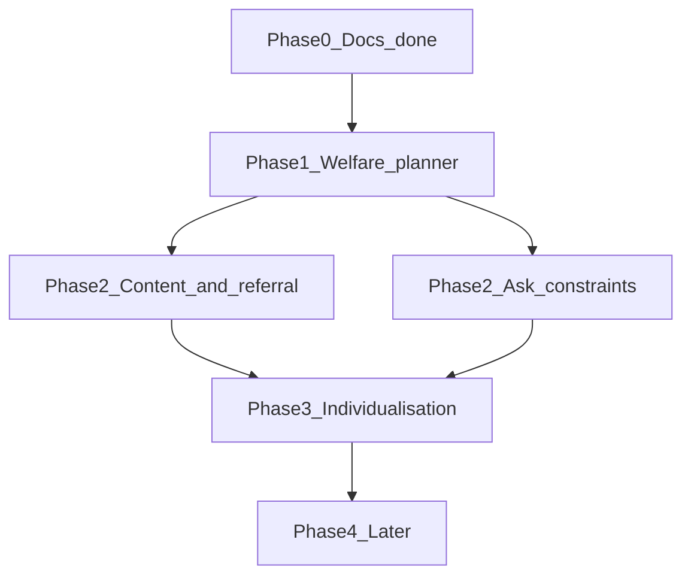

# Improvement Roadmap

**Based on:** [`welfare-principles-audit.md`](./welfare-principles-audit.md), [`exercise-content-audit.md`](./exercise-content-audit.md), [`progression-audit.md`](./progression-audit.md)  
**Date:** 2026-10-09  
**Constraint:** Prefer improving existing code and original content. Do not claim IMDT approval or professional review.

## Change classes

| Class | Meaning |
| --- | --- |
| **E** | Can be implemented confidently from public principles + software evidence |
| **R** | Content/method needs a qualified dog-training professional to review before/after change |
| **Q** | Open question; needs more evidence or consultation |

Keep the app runnable after each phase. Do not rewrite the stack.

---

## Priority legend

| Priority | Meaning |
| --- | --- |
| P0 | Critical — material welfare risk, harmful recommendation path, or serious trust/safety defect |
| P1 | High — methodology, referral, or correctness gaps that undermine a trustworthy coach |
| P2 | Medium — individualisation, content quality, maintainability |
| P3 | Later — valuable but not required for a safe credible MVP |

---

## Phase 0 — Documentation (this pass)

| Item | Status |
| --- | --- |
| Principles matrix, exercise audit, progression audit, checklist, roadmap | Done in `docs/` |
| Production content/progression changes | **Out of scope for this pass** |
| Hotfix before docs | Not required (no aversive prescriptions found) |

---

## Phase 1 — P0 Progression and welfare honesty

### P0-1 Durable welfare-aware plan generation

| Field | Content |
| --- | --- |
| Rationale | Owner-reported discomfort must change future plans, not only flip a skill label |
| Class | E |
| Files | `src/lib/domain/progression.ts`, `plan-generator.ts`, `services/plans.ts`, `services/sessions.ts`, possibly schema for cooldown fields |
| Implementation | Persist welfare cooldown; `generateDailyPlan` reads recent `welfareConcern` / cooldown; exclude or replace affected exercises; use `summariseRecentOutcomes` or replace it with a used API |
| Dependencies | None |
| Regression risks | Plans become more conservative (acceptable); existing dogs mid-progress |
| Tests | Scenario 5: welfare → next plan prefers easier/calm; not cleared by one easy |
| Acceptance | Help text “we’ll simplify” is true in code; Vitest covers cooldown |
| Qualified review | No for mechanism; yes later for default cooldown length (**Q**) |

### P0-2 Never boost `needs_easier` without a safer alternative

| Field | Content |
| --- | --- |
| Rationale | Score +2 can re-prescribe the same hard task |
| Class | E |
| Files | `plan-generator.ts` (`scoreExercise`, selection loop) |
| Implementation | Remove blind +2; if `needs_easier` and no `easierVariationId`, select a different foundation/calm exercise; set honest why-today |
| Dependencies | P0-1 helpful but not strictly required |
| Tests | Leave-it / greeting style objectives with `needs_easier` do not return the same exercise ID |
| Acceptance | Struggle cannot produce unchanged difficulty recommendation when alternatives exist |
| Qualified review | No |

### P0-3 Align owner-facing claims with behaviour

| Field | Content |
| --- | --- |
| Rationale | `help-worried` overclaims |
| Class | E |
| Files | `src/lib/content/help.ts`, possibly `ExerciseRunner.tsx` done-state copy |
| Implementation | Rewrite claims to match P0-1/2 behaviour; never promise perfect understanding of the dog |
| Dependencies | Land with or immediately after P0-1 |
| Acceptance | No help/UI sentence asserts planner behaviour that tests do not enforce |
| Qualified review | No |

### P0-4 Regression suite for the ten scenarios

| Field | Content |
| --- | --- |
| Rationale | Prevent welfare/progression regressions |
| Class | E |
| Files | `progression.test.ts`, `plan-generator.test.ts`, new integration tests as needed |
| Implementation | Cover scenarios in progression audit §1–10 (referral freeze can be pending until P1) |
| Acceptance | `npm run test` green; CI includes these cases |
| Qualified review | No |

**Phase 1 exit criteria:** Welfare and struggle paths are deterministic, tested, and honestly described.

---

## Phase 2 — P1 Content method, referral, and Ask safety

### P1-1 Rewrite `ex-lead-loose` away from stop-and-wait −R pattern

| Field | Content |
| --- | --- |
| Rationale | Conflicts with IMDT Code’s public avoidance of negative reinforcement as a training tool |
| Class | E draft + **R** before treating as final |
| Files | `exercises.ts` (`ex-lead-loose`), bump `contentVersion`, reseed versions |
| Implementation | Reinforce soft-lead; change direction / reset engagement instead of stalemate wait; keep anti-aversive safetyNote |
| Dependencies | Content checklist |
| Regression | Owners mid lead-walking progress see new version going forward only (snapshots protect history) |
| Acceptance | No step instructs withholding motion until slack; checklist pass; reviewer sign-off tracked as **R** |
| Qualified review | **Yes** |

### P1-2 Revise leave-it / door / greetings framing

| Field | Content |
| --- | --- |
| Rationale | Trapping, privilege language, social withdrawal patterns |
| Class | E + **R** for leave-it and greetings |
| Files | `ex-leave-it-easy`, `ex-door-manners`, `ex-greeting-calm` |
| Implementation | Abort criteria; dull-item emphasis; remove privilege wording; add easier variants where missing |
| Acceptance | Exercise audit statuses improve; no privilege/dominance framing remains |
| Qualified review | **Yes** for leave-it and greetings method |

### P1-3 SafetyNotes and in-exercise abort cues

| Field | Content |
| --- | --- |
| Rationale | 9 exercises lack safetyNote |
| Class | E |
| Files | Listed in exercise audit |
| Acceptance | Every published exercise has safetyNote or documented waiver; stop-if-worried glanceable in UI |
| Qualified review | Spot-check **R** optional |

### P1-4 Fix cross-objective harder variation

| Field | Content |
| --- | --- |
| Rationale | `ex-name-mild-distract` → `ex-recall-foundation` |
| Class | E |
| Files | `exercises.ts`; guard in `resolveVariation` to same `learningObjectiveId` |
| Acceptance | Test fails if harder/easier variation crosses objectives |
| Qualified review | No |

### P1-5 Expand referral help + soft out-of-scope screen

| Field | Content |
| --- | --- |
| Rationale | Missing separation, compulsive/self-injurious, immediate-risk guidance |
| Class | E (+ **R** for clinical wording accuracy) |
| Files | `help.ts`, Ask UI, optional onboarding step |
| Implementation | New escalate articles; onboarding checkbox “I need help with biting / severe fear / separation distress…” → show referral, do not generate skill-building plan for that as a “fixable” objective |
| Acceptance | Search finds articles; escalate banner shown; planner does not present aggression “treatment” exercises |
| Qualified review | **Yes** for wording |

### P1-6 Constrain optional Ask AI

| Field | Content |
| --- | --- |
| Rationale | Prompt-only controls are insufficient |
| Class | E |
| Files | `ask.ts`, `AskSearch.tsx` |
| Implementation | Fail closed to approved articles on provider error; post-filter blocklist (shock, prong, alpha, dominate, etc.); if local match has `escalate`, prepend/force referral paragraph; never let AI set progression; minimise PII (avoid sending full profile) |
| Dependencies | Expanded help corpus helps |
| Acceptance | Tests for blocklist; core Ask works with no API key; escalate questions never return “just push through” |
| Qualified review | No for engineering controls |

**Phase 2 exit criteria:** Highest-risk exercises revised or under explicit review hold; Ask cannot casually bypass welfare rules; referral gaps closed.

---

## Phase 3 — P2 Individualisation and maintainability

| ID | Change | Class | Files | Acceptance |
| --- | --- | --- | --- | --- |
| P2-1 | Ease-back after long break using `lastPractisedAt` | E | plan-generator, config | Gap > N days → easier plan; tested |
| P2-2 | Inject `preferredRewards` into exercise preparation UI | E | ExerciseRunner / plan card / actions | Dog’s rewards visible when set |
| P2-3 | Optional session environment field | E | schema, feedback UI, generator | Indoor easy ≠ outdoor promotion |
| P2-4 | Simplify `getting_there` state machine readability | E | progression.ts | Behaviour preserved; tests green |
| P2-5 | Seed/CI assert content checklist fields present | E | scripts/seed, tests | Missing safetyNote fails check |
| P2-6 | Use `knownTriggers` only for caution copy — never breed stereotypes | E | why-today / Ask context | Breed unused in scoring (keep) |

---

## Phase 4 — P3 Later enhancements

| ID | Change | Class | Notes |
| --- | --- | --- | --- |
| P3-1 | Original owner education on marker timing / reward delivery / arousal | E + **R** | Informed by public IMDT outline topics only; original wording; not a course clone |
| P3-2 | Structured “when to seek help” wizard | E + **R** | |
| P3-3 | `reviewedBy` / `reviewedAt` metadata | E | **Only** when a real review occurs — never fabricate |
| P3-4 | Postgres dialect option | E | Optional infra; not welfare-critical |

---

## Suggested implementation sequence

1. Docs (complete)  
2. P0 planner/welfare/tests/copy alignment  
3. P1 lead-loose + leave-it/door/greetings + safetyNotes + variation guard  
4. P1 referral articles + onboarding triage + Ask constraints (can parallelise with content)  
5. P2 individualisation  
6. P3 enhancements with real professional review when available  

---

## Top five improvements (executive)

1. Durable welfare-aware planning (P0-1)  
2. Safer struggle handling without re-prescribing the same hard task (P0-2)  
3. Lead-loose method rewrite + qualified review (P1-1)  
4. Ask AI output constraints and escalate fail-closed (P1-6)  
5. Expanded referral guidance + abort/safetyNotes (P1-3, P1-5)  

---

## Areas requiring qualified professional review

- Lead-walking contingencies after removing stop-and-wait  
- Leave-it pedagogy in an app context  
- Greeting management vs social access withdrawal  
- Puppy sound exposure pacing  
- Default numeric thresholds (`easyResultsForIncrease`, welfare cooldown days, struggle counts)  
- Clinical accuracy of separation / compulsive / immediate-risk help articles  

## Open questions (Q)

1. What welfare cooldown length is appropriate for an owner MVP?  
2. Should environment be mandatory on feedback or optional?  
3. Should onboarding block plan generation when serious concerns are declared, or only annotate Today with referral?  

---

## Acceptance criteria for “roadmap complete” (documentation)

- [x] Findings prioritised with file-level targets  
- [x] E / R / Q distinguished  
- [x] Phases keep product runnable  
- [x] No fabricated compliance claims  

Implementation of P0+ is a **separate** engineering effort after this audit pass.
