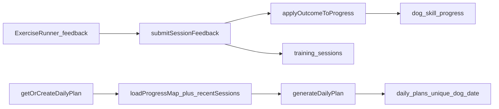

# Progression Engine Audit

**Primary code:**  
[`src/lib/domain/progression.ts`](../src/lib/domain/progression.ts)  
[`src/lib/domain/plan-generator.ts`](../src/lib/domain/plan-generator.ts)  
[`src/lib/services/sessions.ts`](../src/lib/services/sessions.ts)  
[`src/lib/services/plans.ts`](../src/lib/services/plans.ts)  

**Config defaults** (`src/lib/types.ts`):

| Key | Default |
| --- | --- |
| `easyResultsForIncrease` | 3 |
| `recentWindowSize` | 5 |
| `maxPlanMinutesFew` | 5 |
| `maxPlanMinutesAbout10` | 10 |
| `maxPlanMinutesMore` | 15 |
| `avoidRepeatWithinDays` | 1 |

**Audit date:** 2026-10-09  

Thresholds are **configurable starting hypotheses**, not scientifically certified requirements. Treat them as engineering defaults pending evaluation and qualified review.

---

## Data flow

AI (`askOptionalAiAction`) does **not** write progression state today (good). It must stay that way.

---

## Scenario traces

### 1. Newly registered dog, no history

| Item | Detail |
| --- | --- |
| Code path | `generateDailyPlan` → `hasAnyProgress === false` → `starterPool` (engagement, name, reward-marker, mat, rest, handling, lead-intro; + puppy sounds/surfaces for puppies); `difficulty <= 1`; life-stage filter |
| Result | 2–3 short foundation activities (`meta.reason = "starter"`); roles engage/skill/everyday |
| Appropriate? | **Yes** |
| Change | Preserve; optionally bias with `primaryReason` even in starter pool |

### 2. One comfortable completion

| Item | Detail |
| --- | --- |
| Code path | `applyOutcomeToProgress(not_introduced, easy)` → `introduced`, `easyStreak = 1`; guard prevents `ready_to_increase` |
| Next plan | Leaves pure starter pool once any progress exists; may include related skills |
| Appropriate? | **Yes** — does not declare mastery |
| Evidence | `progression.test.ts` “single easy” |

### 3. Intermittent success (`getting_there`)

| Item | Detail |
| --- | --- |
| Code path | Resets `easyStreak` to 0; collapses toward `practising` / `introduced` (branching is hard to read) |
| Harder variation? | No (`shouldPreferHarderVariation` false) |
| Appropriate? | **Mostly yes** (consolidation) |
| Change | Simplify state transitions for maintainability; do not escalate difficulty on mixed results |

### 4. Repeated struggle (`too_difficult`)

| Item | Detail |
| --- | --- |
| Code path | Each call → `needs_easier`, `easyStreak = 0`. **No counter** for N failures → stop skill / refer |
| Plan path | `shouldPreferEasierVariation` → swap `easierVariationId` if present; **`scoreExercise` adds +2 for `needs_easier`** |
| Appropriate? | **No** when no easier variant — same difficulty can be re-selected |
| Change | If no easier variant, prefer a different calm objective; never +2 boost without a safer alternative; after repeated struggles, surface referral/help |

### 5. Owner reports worry / discomfort (`welfareConcern: true`)

| Item | Detail |
| --- | --- |
| Code path | Same branch as `too_difficult` → `needs_easier`; flag stored in `recentOutcomes` JSON and session row |
| Plan path | **`generateDailyPlan` never reads `welfareConcern`**. `summariseRecentOutcomes` is **dead code** (unused imports) |
| Clearance | Next `easy` without welfare: `needs_easier` → `practising` immediately |
| Appropriate? | **No** — UI/help claim durable simplification that code does not fully deliver |
| Change | Durable welfare cooldown (e.g. N days or M sessions); force calm alternatives; do not clear on a single easy; align copy |

### 6. Performs well indoors, struggles outdoors

| Item | Detail |
| --- | --- |
| Code path | **Not modelled.** No environment field on sessions or exercises |
| Result | Indoor `easy` and outdoor `too_difficult` collapse into one skill state |
| Appropriate? | **No** (gap) |
| Change | Optional session context (`indoors` / `quiet_outdoor` / `busy_outdoor`); do not auto-increase outdoor difficulty from indoor success |

### 7. Returning after a long break

| Item | Detail |
| --- | --- |
| Code path | `lastPractisedAt` written in `sessions.ts`; **never read** by generator. `recentlyPractised` only penalises repeats within 1 day |
| Result | Long absence → no ease-back-in |
| Appropriate? | **No** |
| Change | If gap > configurable days, prefer difficulty 1 / previously comfortable exercises; why-today explains gentle restart |

### 8. Prerequisite not yet appropriate

| Item | Detail |
| --- | --- |
| Code path | `prerequisitesMet` requires each prereq exercise’s **learning objective** state ∈ {introduced, practising, becoming_consistent, ready_to_increase} |
| Side effect | Prereq in `needs_easier` or missing → dependent blocked |
| Appropriate? | **Yes** |
| Change | Document; add explicit test; consider also blocking when recent welfare on that objective |

### 9. Different life stage or available time

| Item | Detail |
| --- | --- |
| Code path | `isLifeStageSuitable`; `maxMinutes` + `targetCount` (few → 2 items / 5 min; about_10 → 3 / 10; short plan → 1 / 4) |
| Appropriate? | **Yes** |
| Change | Preserve; ensure first item alone cannot blow the budget without why-today honesty |

### 10. Concern that should trigger referral, not ordinary progression

| Item | Detail |
| --- | --- |
| Code path | **Planner has no referral state.** Only Ask/help if the owner searches. Welfare checkbox does not distinguish “slightly worried” vs “snapped at guest” |
| Appropriate? | **No** for serious cases |
| Change | Escalation outcomes or onboarding/Ask triage; freeze related skill progression; show referral card on Today |

---

## Defect register

| ID | Defect | Severity |
| --- | --- | --- |
| D1 | Welfare flag not used at plan generation time | P0 |
| D2 | `summariseRecentOutcomes` unused | P0 (dead safety helper) |
| D3 | Single easy clears `needs_easier` | P0 |
| D4 | `needs_easier` score +2 without ensuring easier alternative | P0 |
| D5 | No repeated-struggle → stop/refer rule | P1 |
| D6 | No environment/context dimension | P2 |
| D7 | `lastPractisedAt` unused (no long-break easing) | P2 |
| D8 | Cross-objective `harderVariationId` (`name-mild-distract` → recall) | P2 |
| D9 | Completion of plan item ≠ success quality beyond stored outcome (OK if outcome required — currently feedback required before complete) | OK |
| D10 | No numerical “mastery score” shown as science — good | Strength |
| D11 | AI cannot currently set progression — keep invariant | Strength / guard |

### Historical content stability

Sessions store `exerciseVersionId` with JSON snapshots. Plan items pin version IDs. **Meets** requirement that content edits must not silently rewrite history — provided future edits bump `contentVersion` (enforce via checklist/seed).

### Same-day plan stability

Unique index `daily_plan_dog_date_unique`; `getOrCreateDailyPlan` returns existing plan. Concurrent insert falls back to existing. **Meets.**

---

## Proposed conservative progression model

Design goals: explainable, deterministic, independently testable, welfare-first. AI never mutates progression state.

### Skill state (keep, clarify)

`not_introduced` → `introduced` → `practising` → `becoming_consistent` → `ready_to_increase`, with side state `needs_easier` and new flag/fields:

- `welfareCooldownUntil` (timestamp) or `welfareCooldownSessionsRemaining`
- `struggleCountRecent` (rolling)

### Outcome rules (proposed)

1. **Welfare concern:** set `needs_easier`; start welfare cooldown; **exclude** the exercise (and preferably its objective) from plans until cooldown ends **unless** a designated calm alternative is chosen; never clear cooldown on a single easy.
2. **Too difficult:** `needs_easier`; increment struggle count; prefer `easierVariationId` or a different foundation; if struggleCount ≥ configurable threshold, show referral/help and pause that objective.
3. **Getting there:** reset easy streak; stay at current difficulty; no harder variation.
4. **Easy:** increment easy streak only if not in welfare cooldown; require configurable streak across **separate calendar days** before `ready_to_increase` (stronger than same-day spam).
5. **Harder variation:** only from `ready_to_increase`, same learning objective, prerequisites met, no recent welfare on that objective.
6. **Long break:** if `now - lastPractisedAt > breakDays`, temporarily treat as `practising` at reduced difficulty preference.
7. **Environment (future):** do not promote outdoor variants from indoor-only easies.

### Plan selection rules (proposed)

1. Respect time budget and life stage (keep).
2. Include one easy win when possible.
3. Never select an exercise solely because it is next in a fixed list (already true).
4. **Remove** score +2 for `needs_easier` unless an easier variant or calm substitute is actually selected.
5. Prefer variety across categories (keep/improve).
6. Persist plan per dog per local date (keep).

### Why-today honesty

Only claim “we’re keeping this easier because of how last time felt” when cooldown or `needs_easier` with a real easier/calm selection applied.

---

## Test gaps to close (post-audit implementation)

Existing tests cover starter plans, prerequisites, single-easy ≠ mastery, gradual increase, mixed consolidation, difficult → easier preference (partial), welfare → `needs_easier` state, time budgets, repetition avoidance, version uniqueness.

**Missing tests:**

1. Welfare concern changes *next day’s plan composition*, not only skill state  
2. Welfare not cleared by one easy  
3. `needs_easier` without `easierVariationId` does not re-pick same exercise  
4. Long-break easing  
5. Cross-objective harderVariation never selected via `resolveVariation`  
6. Referral freeze (once implemented)  
7. AI path cannot write `dog_skill_progress`

---

## Related documents

- [`welfare-principles-audit.md`](./welfare-principles-audit.md)
- [`exercise-content-audit.md`](./exercise-content-audit.md)
- [`improvement-roadmap.md`](./improvement-roadmap.md)
