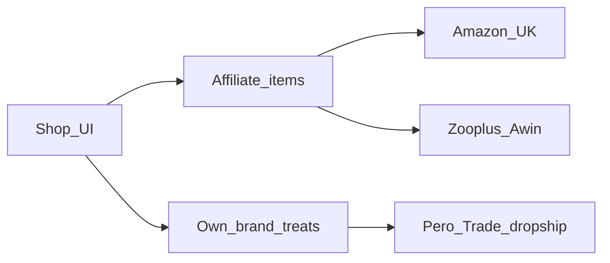

# Shop / Affiliate Plan (UK)

**Updated:** 2026-10-10  
**Status:** Planning only — no shop UI in this branch.  
**Audience:** Good Dog is UK-first; pick partners that ship to (or operate in) the UK.

## Goal

A small **Shop / kit ideas** area that recommends training-relevant items. Keep it honest: optional gear, never required for the plan, and never imply IMDT or professional endorsement of products.

## Two-track model

| Track | How money works | Good Dog role | Use for |
| --- | --- | --- | --- |
| **Affiliate** | Commission on third-party checkout | Outbound links + disclosure (“We may earn a commission”) | Harnesses, leads, pouches, mats, puzzle toys, off-the-shelf treats |
| **White-label / own brand** | Wholesale → retail margin | Merchant of record (“Sold by Good Dog”) | Good Dog–branded soft training treats (later) |

Affiliates do not brand products. White-label does not replace affiliates for walk/session **gear** — named candidate [Pero Trade](https://pero.trade/) supplies **pet food and treats**, not harnesses or long lines.

## Recommendation (Phase 1 — affiliates)

| Priority | Partner | Why |
| --- | --- | --- |
| **1 — start here** | **Amazon Associates (amazon.co.uk)** | Fastest signup for UK creators; huge catalog (treat pouches, long lines, harnesses, mats, puzzle toys); deep links + tracking; familiar checkout for owners. |
| **2 — add soon** | **Zooplus (via Awin)** | Pet-specialist EU/UK retailer; strong dog gear/food assortment; Awin is a standard UK affiliate network once approved. |
| Later | Pet Supermarket / other Awin pet merchants | Useful if Awin approval lands and they stock items Amazon/Zooplus miss. |

**Do not prioritise for UK MVP:** Chewy, Petco (US-centric), The Farmer’s Dog / NomNom / Smalls (US fresh-food subscription models — poor fit for UK shipping, regulatory, and “kit for today’s exercise” use cases).

### Why Amazon UK + Zooplus first

- **Easiest setup:** Amazon Associates UK is self-serve after approval; Zooplus sits on Awin (one network login for multiple pet merchants later).
- **Appropriate items:** Training pouches, Y-harnesses, long lines, lick mats, snuffle mats, treat pouches, enrichment toys — all map cleanly to exercises (loose lead, settle, enrichment, puppy surfaces).
- **Profitability (realistic):** Amazon rates for pet accessories are often modest (~1–4% depending on category); Zooplus/Awin pet rates are often similar or slightly better on basket size. Volume and relevance beat chasing the highest % on irrelevant SKUs. Disclose affiliate relationships in-app.

## Phase 2 — white-label branded treats (Pero Trade)

| Priority | Partner | Why |
| --- | --- | --- |
| **Phase 2 candidate** | **[Pero Trade](https://pero.trade/) (Pero Foods Ltd)** | UK wholesale / private-label dog food & treats (Wales production); trade account; **no MOQ**; **drop shipping**; free bespoke labels. B2B supply + margin — not an affiliate programme. |

### Fit

- **In scope for coaching shop:** Soft, high-value **training treats** under a Good Dog label — maps to Session kit and Puppy basics.
- **Out of scope unless separately justified:** Complete diets, “behaviour cure” food claims, food bowls as a product line, or any medical/nutraceutical positioning.
- **Does not cover gear:** Harnesses, leads, mats, pouches stay on the affiliate track.

### Commercial path (supplier side)

1. Apply for a Pero Trade trade account.  
2. Approve samples and label design with their in-house design team.  
3. Order from the trade shop; default fulfilment = **dropship** (avoid holding inventory).  
4. Only then expose own-brand SKUs in the app shop.

### Gates before coding own-brand commerce

- Trade account approved + sample quality review passed  
- Product claims stay non-medical (same honesty tone as README / privacy — not veterinary advice)  
- UK pet-food labelling / composition responsibilities understood (supplier + Good Dog as brand owner)  
- Fulfilment choice locked: **dropship** by default  
- Checkout: simple Stripe Checkout (or equivalent) for a tiny SKU list — **not** a full marketplace  
- ASA-friendly disclosure: affiliate cards say “We may earn a commission”; own-brand cards say “Sold by Good Dog”

## Suggested catalog shape (when built)

Keep the shop **curated**, not a marketplace dump:

1. **Session kit** — treat pouch, soft treats (affiliate first; **Good Dog treats (branded)** when Phase 2 ships), clicker (optional; marker word is default in-app).  
2. **Walk kit** — well-fitting harness, standard lead, long line (management + recall practice) — **affiliate only**.  
3. **Calm / enrichment** — mat, lick mat, puzzle feeder — **affiliate only** (enrichment snacks only if Phase 2 later expands carefully).  
4. **Puppy basics** — soft toys for mouthing redirect, simple enrichment (no aversives); optional branded soft treats when Phase 2 ships.

Each card: plain English “why this helps”, link to related exercise/glossary term, and the correct disclosure for `saleType` (commission vs sold by Good Dog).

## Implementation sketch (later branch)

| Piece | Notes |
| --- | --- |
| Data | Static `src/lib/content/shop-items.ts`: `id`, `title`, `blurb`, `category`, `relatedExerciseIds`, `relatedTermIds`, `published`, `saleType: "affiliate" \| "own_brand"`, `supplier` (`"amazon" \| "zooplus" \| "pero_trade" \| …`). Affiliate rows: `affiliateUrl`. Own-brand rows: `sku` + fulfilment notes (no affiliate URL required). |
| UI | `/shop` or Learn tab section — list + detail; Phase 1 = outbound links only; Phase 2 = short checkout for own-brand SKUs |
| Compliance | Footer/disclosure on every shop surface; wording differs by `saleType` |
| Env | `AMAZON_ASSOCIATE_TAG`, optional Awin tracking params; later Stripe keys for own-brand — never hardcode secrets |
| Tests | Published affiliate items have https URLs; own-brand items have sku; related exercise/term ids resolve |

Affiliate items stay static outbound links. Own-brand items use checkout → supplier dropship once that integration exists; until trade samples are approved, Phase 2 can stay “coming soon” copy only.

## Open decisions before coding

1. Amazon Associates approval status for the Good Dog domain.  
2. Awin publisher account + Zooplus programme acceptance.  
3. Whether guest users see shop links (recommend: yes, with same disclosure).  
4. Hard ban list: choke/prong/shock, citronella, any aversive “training aids”; white-label limited to soft training treats (never “behaviour cure” food claims).  
5. Whether / when to open a Pero Trade trade account and run sample review (Phase 2 only).

## Out of scope for this planning pass

Shop UI, affiliate account signup, product photography, applying for a Pero Trade account, label design, placing wholesale orders, Stripe, or inventory. This doc is the planning input only.
